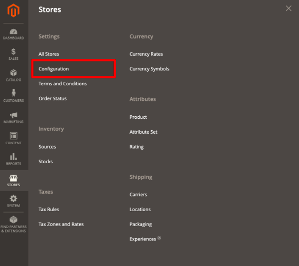
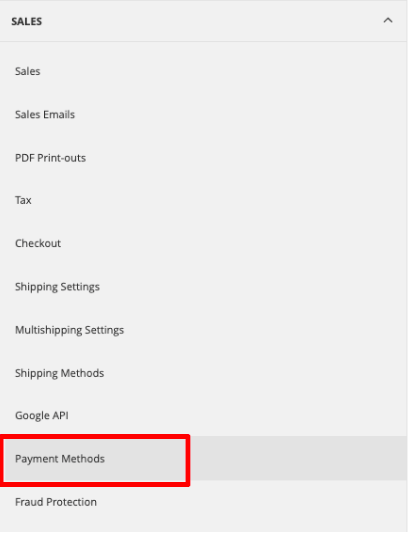
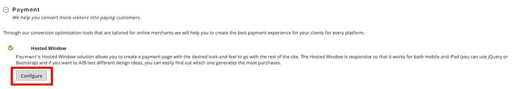
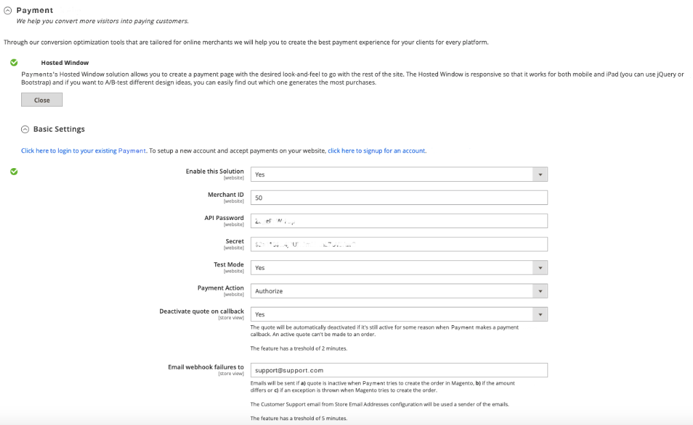

Mondido payments
==============================
Magento 2 module version 2.3.1

FAQ: https://github.com/Mondido/magento2

The Mondido Magento 2 module supports multiple payment methods such as Cards, Invoice, Direct Bank, PayPal and Swish.

## Configuration of Module
To configure the module, you can find it in your administration panel. 

1.Go to: Stores – Configuration

2.Go to: Sales – Payment Methods

3.Scroll down to the bottom and activate by configure 

4.If you already has an account for your payment, you can login to get this settings. If you don’t have any, you can sign up for an new account.

<pre>
Enable this Solution: Yes [Active] 
                      No [Not active] 
                      
Merchant ID: Your identification for your shop, this will be given to you by your Payment Provider

API Password: You will find this through your payment provider, this will be given to you by your Payment Provider

Secret: You will find this through your payment provider, this will be given to you by your Payment Provider

Test Mode: Yes [Shall be active if you want to test your payment function. The use of test cards is only allowed]
           No [Shall not be active if you don’t allow testing your payment function]
           
Payment Action: Authorize - Money will be reserved
                Authorize and Capture - Money will be captured instantly
                
Deactivate quote on callback: Yes [this will deactivate the quote when user gets back to store, recommended]
                              No [do not modify the quote when user gets back, assume payment provider call has deactivated the quote]
                              
Email webhook failures to: E-mail address for all information about failed payments
</pre>